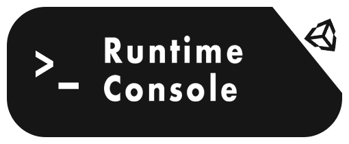
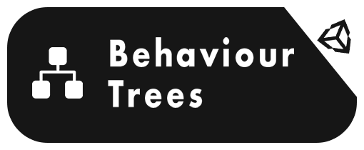
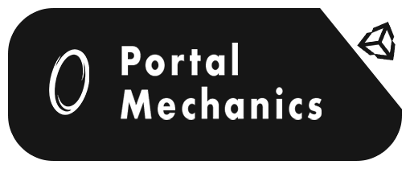
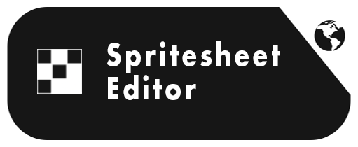
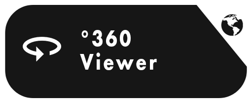

	<h3 align="center">
	🖖 Ahoy. I make stuff for games and pretend I'm a web designer.
</h3>
<!-- 	
 -->
	

		
		
	

	

		
	

<!-- 	
 -->

 
 

<!-- 

	

	

 -->

<!--

  

## 🌐 Web Apps
* web-360
* web-utils
* web-3d
* web-emoji

-->

